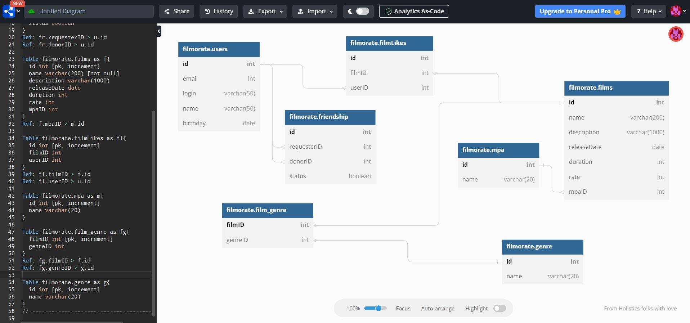

# java-filmorate
Repository for Filmorate - project with Spring Boot and Maven

------

#### На 26.10.2022 приложение умеет:
1. 
2. Full Rest API.
2. Входные данные проходят валидацию.
3. Включено логирование на уровне debug.

#### В планах:
Хранение данных в БД

Приложение написано на Java. Пример кода:
```java
public class Practicum {
    public static void main(String[] args) {
    }
}
```
------
ER-диаграмма:
